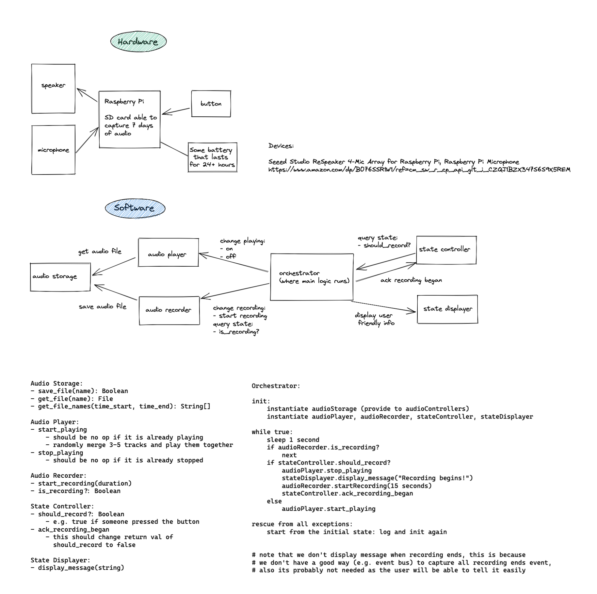

# Burning Man 2022 Project

### Start the collector program
`$> python conversation_collector`

## Priorities
### Art
- Sound sculpture - design & implement different play styles
  - By implementing sculptor.reshape_audio() logic
- Sound sculpture - switch to different styles per hour in day / number of files / etc.
  - By implementing sculptor.reshape_audio() logic
### Fix/Optimizations
- Audio player - 3 threads works pretty bad on RPi 4 HDMI.
  - Update 3/3: looks like using thread is a bad idea. We should experiment merging all audio files into one using (maybe pudub)
    - https://betterprogramming.pub/simple-audio-processing-in-python-with-pydub-c3a217dabf11
  - ... then play it from a standalone process instead of thread. Also try analogue output.
  - Also found that is_playing() sometimes doesn't work - looks like the threads don't exit for some reason.
- Audio player - don't pick the same file in start_playing()
- Audio player - need to handle garbage recordings (no voice / button mis trigger)
- Audio Recorder - in case of disaster during write
  -  write to staging folder then move completed file to the audio folder
- System - make all "print" statement also log to a file
- System - test the heck out of this POC and make it more robust
### Hardware
- Power solution - solar? Swap batteries?
  - Solar Ref: https://hive.burningman.org/posts/14167796
- Make a robust and aestheticlly pleasing shell
  - Directly out of wood?
  - 3D printing with heat-resistent materials then put clay on top?
  - etc.
  - I'm thinking that we should use a 2-tier body where the lower one is reserved for mounting the button only
- Playa installation solution
  - what kind of pole to use
  - the whole thing needs to be resistent to STRONG wind and heat / cold / RAIN
### Nice to have
- Audio Recorder - talks more
  - e.g. after sampling: "Your recording will be played at dawn/evening/midnight!"

## Notes

### Package Dependency 
- tkinter (demo only)
- wave
- RPI.GPIO (pip install RPi.GPIO)
- pyaudio (explained below)
- ESPEAK-NG (explained below)

## Hardcoding / Setup

### Make sure
- the hard-coded path in files_manager.py is present (_folder_path)

### On ESPEAK-NG
- Can't get that pptxy thingy work on my RPi4b so I'm compiling its dependency (espeak) locally and running it with a system command
- LMK if you can apt get espeak to work on RPi : (
- How to install on your machine:
```
sudo apt-get install make autoconf automake libtool pkg-config
git clone https://github.com/espeak-ng/espeak-ng.git
cd espeak-ng
./autogen.sh
./configure --prefix=/usr
make
# get your own path replace below ESPEAK_DATA_PATH
ESPEAK_DATA_PATH='/home/pi/Desktop/espeak-ng' LD_LIBRARY_PATH=src:${LD_LIBRARY_PATH} src/espeak-ng "hello world" -p 50 --stdout | aplay
```

### Installing pyAudio on RPi 4b
```
sudo apt-get install libportaudio0 libportaudio2 libportaudiocpp0 portaudio19-dev
pip install pyaudio
```

## Design
Outdated*

